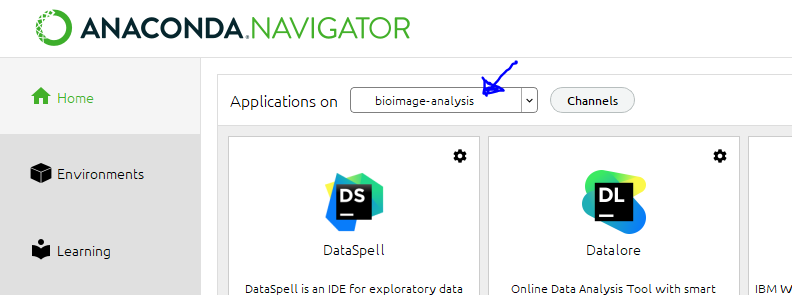
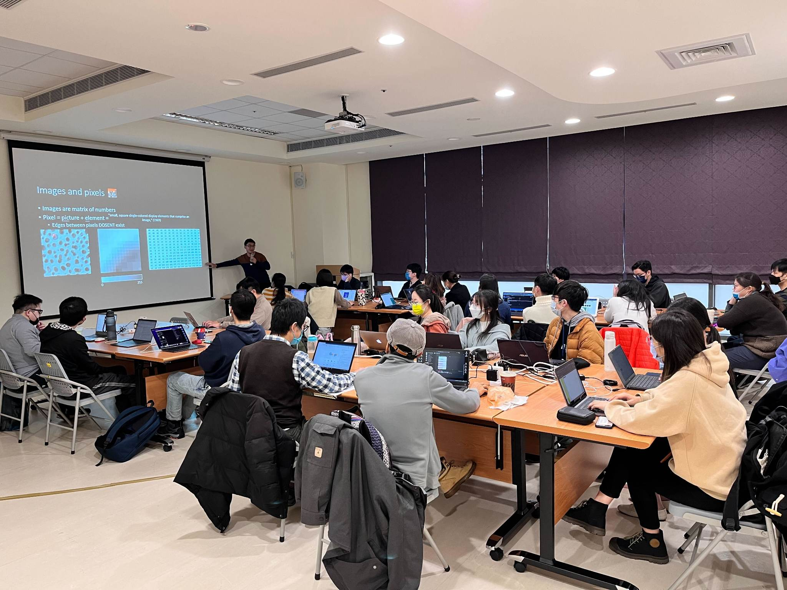
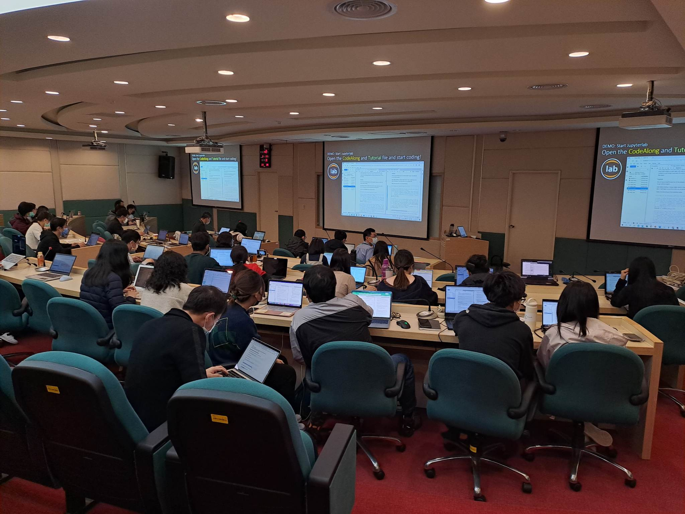
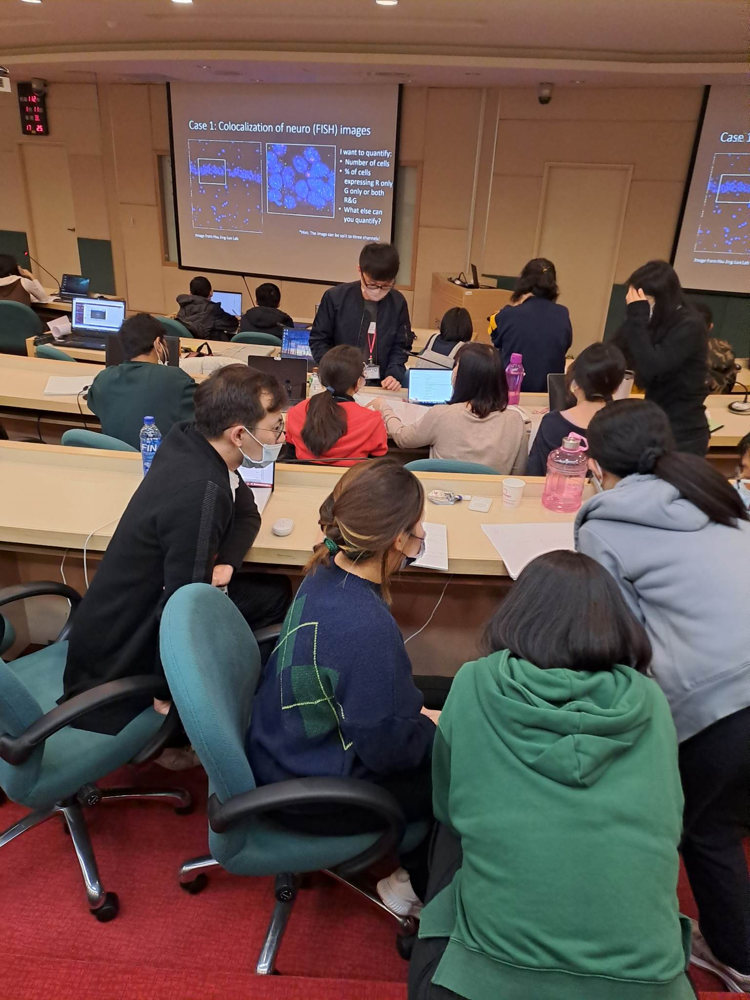

# Bioimage Analysis Workshop Taipei

The course materials for the bioimage analysis workshop at Academia Sinica, Taipei. Please note that these materials have been heavily adopted from:

- **EMBL Bio-IT bioimage analysis workshop**, especially the part by Toby Hodges and Jonas Hartmann: [https://git.embl.de/grp-bio-it-workshops/image-analysis-with-python](https://git.embl.de/grp-bio-it-workshops/image-analysis-with-python)
- **Introduction to Bioimage Analysis** by Pete Bankhead: [https://bioimagebook.github.io/](https://bioimagebook.github.io/)
- **Bioimage Analysis Lecture 2020** by Robert Haase: [https://www.youtube.com/watch?v=e-2DbkUwKk4&list=PL5ESQNfM5lc7SAMstEu082ivW4BDMvd0U](https://www.youtube.com/watch?v=e-2DbkUwKk4&list=PL5ESQNfM5lc7SAMstEu082ivW4BDMvd0U)

## Pre-requirement of the workshop

Please prepare the following before the workshop:

- Please install Anaconda ([https://www.anaconda.com/](https://www.anaconda.com/)) on your laptop (Yes, you need a laptop) and follow the “Creating a Python Environment for the workshop” workflow below for the setup.
- If you are not comfortable with python, please follow the “Basics in Python” Jupyter notebook to learn the basics of python programming
- If you want something more to get yourself more comfortable with python programming for image processing, follow “Basics in Python2” Jupyter notebook.

## Schedule

| Time | Title | Material Covered |
| --- | --- | --- |
| 9.10 - 9.40 | Section 0: Introduction to Terminologies | [Section 0 slide](https://github.com/Koushouu/Bioimage-Analysis-Workshop-Taipei/blob/main/Slides_pdf/Section%200.pdf) |
| 9.50 - 10.30 | Section 1: Introduction to Image Operators | [Section 1 slide](https://github.com/Koushouu/Bioimage-Analysis-Workshop-Taipei/blob/main/Slides_pdf/Section%201.pdf) |
| 10.30 - 12.30 | Codelab 1: Python Bio-image Processing | [Codelab section 1](https://github.com/Koushouu/Bioimage-Analysis-Workshop-Taipei/tree/main/codelab) |
| 12.30 - 13.30 | Lunch Break | n/a |
| 13.30 - 14.30 | Section 2: Introduction to ML and ML tools | [Section 2 slide](https://github.com/Koushouu/Bioimage-Analysis-Workshop-Taipei/blob/main/Slides_pdf/Section%202.pdf) |
| 14.30 - 16.30 | Codelab 2: Python ML and Bio-statistics | [Codelab section 2](https://github.com/Koushouu/Bioimage-Analysis-Workshop-Taipei/tree/main/codelab), [Google Colab for Cellpose](https://github.com/Koushouu/Bioimage-Analysis-Workshop-Taipei/blob/main/Cellpose_2_0_in_colab_part_1_v2.ipynb) |
| 16.30 - 17.00 | Coffee Break & Networking | n/a |
| 17.00 - 18.30 | Section 3: How to Think like a Bioimage Analyst | [Section 3 slide](https://github.com/Koushouu/Bioimage-Analysis-Workshop-Taipei/blob/main/Slides_pdf/Section%203.pdf) |

<aside>
💡 Although here everything was in one day, in the future I would split it to a two-day event

</aside>

## Creating a Python Environment for the workshop

1. With the Anaconda prompt, create a virtual environment with the name “bioimage-analysis”

    ```powershell
    conda create --name bioimage-analysis python=3.8
    ```

2. Then activate the environment

    ```powershell
    conda activate bioimage-analysis
    ```

3. Install all the necessary packages

    ```powershell
    conda install numpy matplotlib scipy scikit-image ipywidgets
    ```

    then

    ```powershell
    jupyter nbextension enable --py --sys-prefix widgetsnbextension
    ```

4. In anaconda navigator, change the environment to the newly created environment

    

5. Install Jupyter Lab (Or Jupyter notebook) in this environment
6. Launch the Jupyter Lab (Or Jupyter notebook) and navigate to the downloaded files

## Past events

I am happy to report that I have successfully run this event twice. The first event was for the Neuroscience Program at Academia Sinica (NPAS) on January 4th, 2023 and had over 25 attendees, mostly with backgrounds in neurosciences. The second event was for the Institute of Cellular and Organismic Biology (ICOB) and Institute of Biological Chemistry (IBC) which was open to all at Academia Sinica, on January 11th, 2023. This event had over 50 attendees from various backgrounds including plant biology, biochemistry, cell biology and biophysics.

### Some pictures from the event:

**BiA@NPAS (2023.1.4)**




**BiA@ICOB (2023.1.11)**




## Acknowledgement

My Teaching Materials are mostly based on the following resources:

- **[Bioimage Book](https://bioimagebook.github.io/)** by **Peter Bankhead**
- **[Lecture Bioimage Analysis 2020](https://www.youtube.com/playlist?list=PL5ESQNfM5lc7SAMstEu082ivW4BDMvd0U)** by **Robert Haase**
- **[Bioimage Analysis in Python Jupyter Notebook](https://git.embl.de/grp-bio-it-workshops/image-analysis-with-python)** by **Jonas Hartmann & Toby Hodges**
- **[Google Colab Notebook for Cellpose](https://github.com/MouseLand/cellpose)** by **Marius Pachitariu**

## Funding Sources

BiA@NPAS (2023.1.4):

- [Neuroscience Program at Academia Sinica (NPAS)](https://npas.programs.sinica.edu.tw/npas_about_us_en.html)

BiA@ICOB (2023.1.11):

- [Bioimaging Core Facility, IBC, AS](https://www.ibc.sinica.edu.tw/Facility?Lang=En&FGDatetimeStr=20210917095933&FDatetimeStr=20211228095641)
- [Imaging Core Facilities, ICOB, AS](http://sl.icob.sinica.edu.tw/image-core/)

## Helps & Advice

**Inside Academia Sinica:**
- Hsu Ching-Lung 徐經倫老師 (NPAS) and his lab (Esp. Hsuan-Pei Huang 黃宣霈)
- Shang-Te Danny Hsu 徐尚德老師 (IBC) and his lab
- Bi-Chang Chen 陳壁彰老師 (NPAS) and his lab (Esp. Jia-Ming Liu 李佳銘學長 and Yin-Tzu Xie 謝尹慈)
- Yu-Wei Wu 吳玉威老師 (NPAS)
- Ya-Jen Cheng 鄭雅仁學姊 (NPAS)
- Jung-Kun Wen 温榮崑學長 (IBC ImageCORE)
- Wei-Chen Chu 朱韋臣學長 (ICOB ImageCORE)
- You-Hsuan Liu 劉又萱 (IOP)
- My parents (Koukounut Family)…

**Outside Academia Sinica**
- Robert Haase (TU Dresden)
- Jonas Hartmann (UCL London)
- Chien-Cheng Michael Shih (Novartis US)

**My previous labs and their members (if not mentioned before):**

- John Briggs’s (MRC LMB Cambridge)
- Jonas Ries’s (EMBL Heidelberg)
- Ricardo Henriques’s (LMCB UCL London)
- Steven Lee’s (Chemistry Cambridge)
